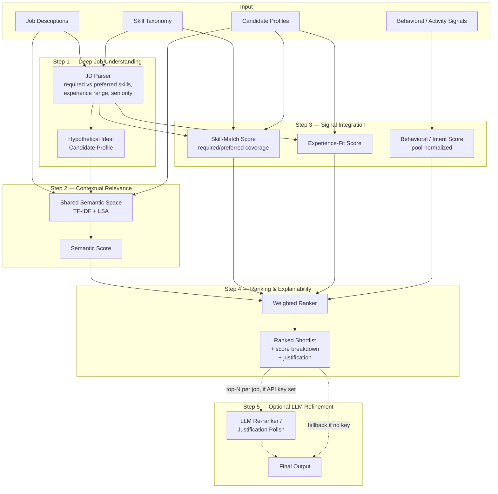

# Intelligent Candidate Discovery
### India Runs by Redrob AI — Track 1: The Data & AI Challenge

A working proof-of-concept for an AI-native candidate ranking engine that goes
beyond keyword filters — combining **contextual semantic understanding**,
**explainable skill-coverage analysis**, **career-fit modeling**, and
**behavioral/intent signals** into a single, transparent ranking with
human-readable justifications.

---

## 1. The Problem, As We Read It

Traditional ATS keyword filters fail in two specific ways:

1. **They miss "hidden gems"** — candidates whose resumes are phrased
   differently from the job description but who substantively have the
   right skills (e.g. a "Software Developer" who has quietly built three
   ML side-projects, vs. someone with "Machine Learning Engineer" stamped
   on their title but stale skills).
2. **They can't tell who's actually reachable right now.** Two candidates
   can look identical on paper, but one updated their profile last week and
   completed a relevant certification, while the other hasn't logged in for
   six months. Recruiters need to know which one to call first.

Our system is built explicitly to solve both problems, and the rest of this
document explains exactly how — with full transparency into every score.

---

## 2. Architecture Overview



The pipeline is **fully modular and config-driven** — every box above maps
to one file in `src/`, and `config.yaml` controls data paths, column
mappings, and ranking weights without touching any code.

---

## 3. Methodology

### 3.1 Deep Job Understanding (`src/job_understanding.py`)

Each job description is parsed into a structured spec:

- **Required vs. preferred skills**, detected via a 25-skill taxonomy
  (`data/skills_taxonomy.json`) with synonym/abbreviation support (e.g.
  "ML" ↔ "machine learning", "JS" ↔ "javascript"). Skills are classified as
  required vs. preferred using **sentence-level cue detection** — each
  sentence is scanned for cue phrases ("required", "must have", "nice to
  have", "preferred", "is a plus", etc.), and whichever cue type appears
  *first* in the sentence determines the bucket for every skill mentioned in
  that sentence. This correctly handles patterns like *"Must have strong
  experience with Python, ML, and deep learning (transformers, BERT/LLMs
  preferred)"* — the dominant "must have" wins for Python/ML/deep learning,
  while a separate *"Nice to have: AWS, Spark/Airflow"* sentence is
  correctly bucketed as preferred.
- **Experience range** (min/max years) via regex over phrases like
  "2-5 years" or "3+ years".
- **Seniority level** (junior / mid / senior / lead) via keyword detection.

From this structured spec, we synthesize a **"hypothetical ideal candidate"
profile** — a short, skills-forward description of what a perfect candidate
would look like for this role. This is the offline analogue of the
"hypothetical resume" technique from recent resume-matching research
(ConFit v2): comparing real resumes against this *synthetic ideal*, in
addition to the raw JD text, helps catch substantively-strong candidates
whose resumes are phrased very differently from the posting.

### 3.2 Contextual Relevance (`src/semantic_matcher.py`)

All job descriptions, hypothetical ideal profiles, and candidate resumes are
embedded into a **shared TF-IDF + Latent Semantic Analysis (LSA / TruncatedSVD)
space**. Each candidate's `semantic_score` is the average of:

- cosine similarity to the raw JD text, and
- cosine similarity to the JD's hypothetical ideal profile.

This is a fully offline, dependency-light technique that still captures
co-occurrence-based semantic structure (e.g. a resume mentioning "neural
networks, PyTorch, BERT" lands close to a JD asking for "deep learning /
NLP" even with **zero exact keyword overlap**).

> **Swap point for production:** `SemanticSpace.fit()` is the single place
> that produces document embeddings. Replace it with calls to a
> sentence-embedding model (Anthropic/OpenAI embeddings, or a local
> sentence-transformers model) to get state-of-the-art dense embeddings —
> nothing else in the pipeline needs to change, since everything downstream
> only depends on getting back an `[n_docs x n_dims]` matrix.

### 3.3 Signal Integration (the heart of the brief)

Three complementary signals are combined with semantic relevance:

**a) Skill-match score** (`src/skill_match.py`) — taxonomy-based overlap
between the candidate's detected skills and the JD's required/preferred
skills, weighted 75% required / 25% preferred by default. Returns matched
and missing skill lists for explainability.

**b) Experience-fit score** (`src/experience_fit.py`) — a trapezoidal curve:
full score within the JD's target experience range, a steep penalty for
being *under*-qualified (0.25/year shortfall), and a gentler penalty for
being *over*-qualified (0.10/year excess, floored at 0.5) — overqualification
is a softer signal (flight-risk/compensation) than a genuine capability gap.

**c) Behavioral / intent score** (`src/behavioral_scoring.py`) — **this is
the "subtle signals lost in the noise" piece the brief explicitly calls
out.** Drawing on how real talent-intelligence platforms operationalize
"intent signals" (recency of activity, profile updates, content engagement,
upskilling), we compute a pool-normalized composite from:

| Signal | Weight | Why it matters |
|---|---|---|
| Days since last active | 25% | Recency is the strongest "in-market right now" proxy |
| Profile updates (last 90d) | 15% | Actively curating their profile = open to opportunities |
| Courses completed (last 6mo) | 15% | Active upskilling signals career momentum/intent |
| Profile completeness | 15% | Completeness correlates with serious job-seeking |
| Skill endorsement growth | 10% | External validation trending up |
| Content engagement (career topics) | 10% | Eightfold/LinkedIn-style "passive intent" signal |
| Applications in last 30 days | 10% | Direct evidence of active job search |

Each signal is **min-max normalized across the current candidate pool**
(not hardcoded thresholds), so the score remains meaningful regardless of
the raw data's scale. Missing values default to the pool median so
candidates with incomplete behavioral data aren't unfairly penalized.

### 3.4 Ranking (`src/ranker.py`)

```
final_score = 0.35 × semantic_score
             + 0.30 × skill_match_score
             + 0.15 × experience_fit_score
             + 0.20 × behavioral_score
```

Weights are configurable in `config.yaml` under `ranking_weights`. Every
candidate gets a 1-sentence, rule-based **justification** referencing the
specific skills matched/missing, experience fit, and behavioral highlights
(e.g. *"active in the last 3 days; completed 1 relevant course(s) in the
last 6 months"*).

### 3.5 Optional LLM Refinement (`src/llm_rerank.py`)

If `ANTHROPIC_API_KEY` is set and `llm_rerank.enabled: true` in
`config.yaml`, the top-N candidates per job (by rule-based score) are sent
to Claude with their full score breakdown, and the LLM writes a sharper,
recruiter-facing justification — catching nuance the rule-based system
might miss (e.g. recognizing that 3 substantial ML side-projects can
offset a shorter formal-experience window). **This step is fully optional**
— if no API key is configured, or the call fails for any reason, the
pipeline transparently falls back to the rule-based justifications. The run
never breaks because of this step, and the output includes a
`justification_source` column (`rule_based` or `llm`) for full transparency.

### 3.6 Explainability & Data Validation (`src/data_validation.py`)

**Every rule-based justification is built ONLY from already-computed,
factual fields** — matched/missing skills, score components, behavioral
highlights — with zero free-text generation. There is nothing for it to
hallucinate; it is a template filled in with numbers and lists that were
computed earlier in the pipeline.

The optional LLM refinement step (§3.5) is the only place free text is
generated, so it gets a dedicated **grounding check**:
`data_validation.validate_llm_justification()` re-runs the same
taxonomy-based skill extractor used everywhere else in this codebase on the
LLM's own output text, and checks that every skill it asserts is contained
in the "grounding set" — the union of (a) the job's required + preferred
skills and (b) the candidate's own detected skills, i.e. everything the LLM
was actually shown. **If the LLM mentions a skill outside that set, its
output is rejected for that candidate and the rule-based justification is
used instead.** This is enforced per-candidate, automatically, every run.

**Handling inconsistent / low-quality / suspicious profiles:**
`data_validation.compute_quality_flags()` runs over every candidate before
ranking and flags:

| Flag | Trigger | Effect |
|---|---|---|
| `sparse_profile` | Resume text under 8 words — too little to assess | Final score discounted ×0.85, noted in justification |
| `implausible_experience_value` | `years_experience` negative or > 45 | Surfaced for review (no auto-penalty) |
| `skills_not_substantiated_in_narrative` | >80% of listed skills never appear in the resume narrative (possible keyword-stuffing) | Surfaced for review |
| `possible_duplicate_profile` | Resume text is near-identical to another candidate's (possible copy-paste/spam) | Surfaced for review, noted in justification |

Flags are **surfaced, not silently acted on** (except the sparse-profile
discount, where our scoring is genuinely unreliable) — a human recruiter
always makes the final call, consistent with the responsible-AI framing in
§9. All flagged candidates appear in `data_quality_flags` and
`justification` in the output CSV.


## 4. Project Structure

```
intelligent-candidate-discovery/
├── config.yaml                  # data paths, column mapping, weights — edit this for the real dataset
├── requirements.txt
├── run.py                        # CLI entry point
├── app.py                         # optional Streamlit demo UI
├── data/
│   ├── skills_taxonomy.json      # extend this for your domain
│   ├── generate_sample_data.py   # regenerates the synthetic demo data
│   ├── jobs.csv                  # SAMPLE data — replace with real dataset
│   ├── candidates.csv            # SAMPLE data — replace with real dataset
│   └── behavioral_signals.csv    # SAMPLE data — replace with real dataset
├── src/
│   ├── data_loader.py            # CSV loading + column-name mapping
│   ├── job_understanding.py      # JD parsing -> structured requirements
│   ├── semantic_matcher.py       # TF-IDF + LSA embeddings, cosine similarity
│   ├── skill_match.py            # taxonomy-based skill coverage scoring
│   ├── experience_fit.py         # years-of-experience fit curve
│   ├── behavioral_scoring.py     # pool-normalized intent/activity scoring
│   ├── data_validation.py        # quality flags + LLM hallucination guardrail
│   ├── ranker.py                 # combines signals -> ranked shortlist
│   ├── llm_rerank.py             # optional LLM-based refinement
│   └── pipeline.py               # orchestrates everything
└── outputs/
    └── ranked_shortlist.csv      # generated output (the "Results" deliverable)
```

---

## 5. Setup & Usage

```bash
pip install -r requirements.txt

# (Re)generate the synthetic demo dataset (optional — sample CSVs are already included)
python data/generate_sample_data.py

# Run the full pipeline
python run.py
```

This prints the parsed job-requirement breakdown and top candidates per job
to the console, and writes the full ranked shortlist to
`outputs/ranked_shortlist.csv`.

### Plugging in the official India Runs dataset

1. Download the official challenge dataset from your Hack2skill dashboard.
2. Place the files under `data/` (or anywhere — just update the paths).
3. Open `config.yaml` and update `data.*_path` to point at the new files.
4. Update `column_map` so the pipeline's internal field names map to the
   real dataset's column headers — **no Python code changes needed.**
5. If the predefined output format uses different column names than
   `outputs/ranked_shortlist.csv`, rename the relevant columns in
   `ranker.py`'s output dict (clearly marked, ~15 lines).
6. Re-run `python run.py`.

### Enabling the optional LLM refinement step

```bash
export ANTHROPIC_API_KEY=your_key_here
pip install anthropic
```
Then set `llm_rerank.enabled: true` in `config.yaml`.

---

## 6. Output Format

`outputs/ranked_shortlist.csv` contains one row per (job, shortlisted
candidate), sorted by `rank` within each `job_id`:

| Column | Description |
|---|---|
| `rank` | Position within this job's shortlist (1 = best) |
| `job_id`, `job_title` | The job this row is ranked for |
| `candidate_id`, `candidate_name`, `current_title`, `years_experience` | Candidate identity/metadata |
| `final_score` | Weighted composite score, 0-100 (discounted for `sparse_profile` candidates — see §3.6) |
| `semantic_score`, `skill_match_score`, `experience_fit_score`, `behavioral_score` | Score breakdown, each 0-100 |
| `matched_required_skills`, `missing_required_skills` | Explainability — required-skill coverage |
| `candidate_detected_skills` | All taxonomy skills detected for this candidate (explainability + LLM grounding) |
| `data_quality_flags` | `sparse_profile`, `implausible_experience_value`, `skills_not_substantiated_in_narrative`, `possible_duplicate_profile`, or empty (see §3.6) |
| `justification` | 1-sentence human-readable explanation |
| `justification_source` | `rule_based` or `llm` |

`top_k_per_job` in `config.yaml` controls how many candidates are kept per
job (default 10).

---

## 7. Worked Example (from the included sample data)

For **J001 — Machine Learning Engineer** (required: Python, ML, deep
learning, NLP, SQL; preferred: data engineering, cloud), the full 40-candidate
ranking demonstrates exactly the behaviors this challenge asks for:

- A candidate with a **100% keyword/skill match** but a profile dormant for
  4+ months (behavioral score ~11) is ranked **#6**, below several
  candidates with lower raw skill overlap but strong recent activity.
- Two **"hidden gem" candidates** — titled "Software Developer", with resumes
  that don't use ML-engineer phrasing but describe real ML side-projects and
  recent upskilling — land in the **top third** of the ranking (ranks
  10-14), ahead of more than a dozen candidates from adjacent domains
  (Business/Product Analysts) with similar or lower skill coverage.
- Off-domain candidates (Sales, HR, Content) correctly sink to the bottom of
  the ranking despite high behavioral activity, because both their skill
  match and semantic relevance are near zero.
- The sample data also includes a few deliberately "suspicious" profiles
  (see `data/generate_sample_data.py`): a near-empty profile gets the
  `sparse_profile` flag and a score discount; a candidate with
  `years_experience = 60` gets flagged `implausible_experience_value`; and
  two candidates with verbatim-identical resume text both get flagged
  `possible_duplicate_profile`. All three appear with their flags and an
  explanatory note in `outputs/ranked_shortlist.csv` whenever they place in
  a job's top-K.

Run `python run.py` to reproduce this and see the full breakdown.

---

## 8. Design Decisions & Trade-offs

- **Explainability over black-box accuracy.** Every score component is
  human-readable and traceable to specific evidence. In a hiring context,
  "the model said so" is not an acceptable answer to a candidate or
  regulator — this design treats explainability as a first-class
  requirement, not an afterthought.
- **Offline-first, swap-friendly.** TF-IDF + LSA requires no model downloads
  or API keys, so the PoC runs anywhere instantly. The architecture is
  explicitly designed so the embedding layer can be swapped for a
  state-of-the-art model (Sentence-BERT, or an LLM embeddings API) with a
  one-file change.
- **Pool-relative normalization for behavioral signals**, not fixed
  thresholds — this makes the system robust to different data
  distributions without re-tuning, and is how real ranking systems handle
  heterogeneous activity data.
- **Required-skill precedence in JD parsing.** When a skill is mentioned in
  both a "required" and a "preferred" context (common in real JDs), we
  treat it as required — the safer assumption for not under-shortlisting.

---

## 9. Responsible AI Notes

- The skill taxonomy and scoring are based entirely on **professional
  attributes** (skills, experience, activity) — no demographic data is used
  or required anywhere in the pipeline.
- Every ranking decision is **fully explainable** via the score breakdown
  and justification columns — this is designed to support a human recruiter
  making the final call, not to replace one.
- Behavioral scoring intentionally avoids any signal that could proxy for
  protected characteristics (e.g. it does not use age, location-based
  inference, name-based inference, etc.) — only activity/intent metrics
  directly tied to job-seeking behavior.

---

## 10. Limitations & Future Work

- **Embeddings**: TF-IDF + LSA is a strong, transparent offline baseline but
  is outperformed by transformer-based sentence embeddings on nuanced
  semantic matches — see the swap point in §3.2.
- **JD parsing**: rule-based sentence-cue classification handles common JD
  patterns well but can be extended with an LLM-based structured extractor
  (the `llm_rerank.py` module shows the integration pattern) for fully
  arbitrary phrasing.
- **Skill taxonomy**: currently ~25 skill families covering tech, product,
  and business roles — trivially extensible via `data/skills_taxonomy.json`
  for domain-specific coverage (e.g. healthcare, manufacturing).
- **Learning-to-rank**: ranking weights are currently hand-tuned; given
  historical hire/no-hire outcome data, these could be learned via a
  pairwise ranking model (e.g. LightGBM LambdaMART) while keeping the same
  explainable feature set.

---

## 11. Sample Data Disclaimer

The CSVs included under `data/` are **entirely synthetic**, generated by
`data/generate_sample_data.py` for demonstration purposes (no real candidate
data is used). Swap in the official India Runs dataset per §5 to evaluate
against real data.
